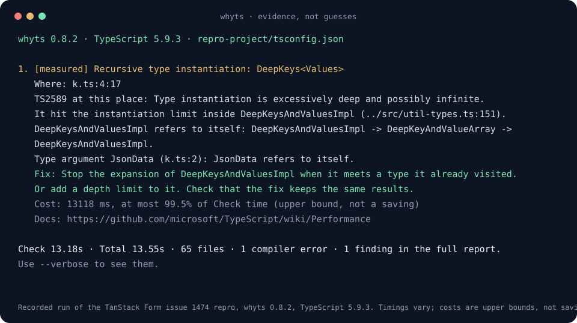

# whyts

[](https://www.npmjs.com/package/whyts)
[](https://github.com/musatoktas/whyts/actions/workflows/ci.yml)
[](https://nodejs.org)
[](LICENSE)

**Find out why your TypeScript project is slow.**

A small CLI that turns compiler diagnostics, traces, and import relationships into evidence you can act on. No account, API key, or LLM required.



## Try it

Requires Node.js 20+ and a TypeScript project with dependencies installed.

```sh
npx whyts --project .
```

For repeatable runs, pin a version: `npx whyts@0.6.0 --project .`

To run from a checkout:

```sh
git clone https://github.com/musatoktas/whyts.git
cd whyts
npm ci --ignore-scripts
npm run demo
node src/cli.js --project /path/to/your/tsconfig.json
```

## What it finds

| Finding | Evidence | What it does **not** claim |
| --- | --- | --- |
| Source check chains | Related expression/variable locations grouped by same-thread temporal nesting, inclusive chain duration, contained type comparisons with names and declaration locations | That nesting or a contained comparison proves the cause of a slowdown |
| Broad inclusion | Effective `include` and configured root count | That every broadly included file is unnecessary |
| Roots worth reviewing | Generated and output roots with no observed importers. Test and spec roots are only counted | That unimported files are safe to delete |
| Duplicate type versions | Multiple versions of an `@types` package loaded into the program | That all duplicate versions can safely be aligned |
| Barrel reach | Reexport count, importers, transitive file reach, reached files already configured as roots | Exclusive check cost, bundler behavior, or guaranteed savings |
| Slow file checks | Recorded `checkSourceFile` trace intervals | Complete attribution of total time or the exact expensive type |
| Compiler errors | The first five errors, the error code counts, and a warning when unresolved modules dominate | That the timings are valid when dependencies are missing |

Findings are labeled **measured**, **observed**, or **review**. Measured source check chains appear first, with project code prioritized over dependencies. Chain spans below 10 ms and file spans below 100 ms remain in the recorded data without becoming findings. Structural suggestions follow in a separate section. Suggested changes require a fresh measurement and behavior checks. whyts never invents a predicted speedup.

## From a file to an expression and its types

```sh
npm run demo:types
```

The 16-line example assigns a mapped API client with 676 routes to a public client shape. The report can show the assignment at `client.ts:16:14`, the `FullClient` to `PublicClient` comparison recorded inside that check, and their declarations at lines 8 and 11. For example, one local TypeScript 5.9.3 run recorded 38.4 ms for the variable check and 31.8 ms for this comparison. These are inclusive samples from that run, not stable benchmarks or speedup claims. A fast run can omit sampled expression/comparison events.

Nested checks in the same file and trace thread are shown as one chain, leaving room for other expensive checks. Each chain includes its entry location and up to five related checks. The focus is the deepest recorded non-identifier check covering at least 80% of the chain's recorded duration, falling back to its largest member. This is a navigation heuristic; deferred checks can visit earlier source lines, and temporal nesting is not AST containment or proof of causality. Inclusive member durations overlap and must not be added.

Type IDs are resolved selectively from the compiler's `types.json`, including files larger than 128 MiB. whyts streams individual descriptors and retains only IDs needed by the selected report entries. Named types, compiler flags, union/intersection member counts when available, and declaration locations give a concrete place to investigate. The project's compiler scanner skips leading whitespace and comments to show the declaration's first token. Unresolved IDs remain explicit. Comparisons without a containing recorded expression are listed separately without source attribution. Definition locations may point into a dependency, and are context rather than a proposed fix.

Project file intervals have their own list, so large dependency checks cannot hide every project file. If all files reached by a barrel are already configured roots, whyts explains why changing that import alone will not remove them from the program.

## Share of Check time

Each measured chain and file interval shows an upper bound. The terminal report says "at most N% of Check time". JSON has `checkTimeShareUpperBoundPercent`.

The value is the inclusive interval divided by the compiler `Check time`. It is not a prediction. The compiler recorded the interval during a trace run, and the trace run is slower than a normal run. A change to the code does not remove the whole share.

## Explain a file

```sh
node src/cli.js explain src/shared/value.ts --project /path/to/project
```

File paths are relative to the selected tsconfig directory. The result shows a configured-root reason or one shortest observed import/reference chain, plus direct importers. Import resolution respects TypeScript `paths`, reexports, dynamic imports, and ESM/CJS usage modes.

This is a compact explanation, not a complete implementation of `tsc --explainFiles`. Library inclusion, ambient type directives, symlinks, and project-reference redirection can require the compiler's own explanation.

## JSON and automation

```sh
node src/cli.js --project apps/web/tsconfig.json --json > report.json
node src/cli.js --project apps/web --timeout 300 --no-color
```

JSON has `schemaVersion`, compiler version, summary, diagnostics with units, findings with evidence, hotspots, and warnings. Version 0.3 adds `sourceGroups` and `typeDescriptors` while preserving schema version 1 and the existing `hotspots`, `projectHotspots`, `sourceHotspots`, and `typeHotspots` meanings. Measured source findings now use rule `source-check-chain` and chain evidence. `sourceGroups` includes `root`, `members`, `memberCount`, inclusive `milliseconds`, and the chosen expression's `focusMilliseconds`. `typeDescriptors` records file/scanned/retained bytes and requested/resolved ID counts. Source/type records include durations in milliseconds; source and declaration locations use one-based `line`/`character`, and source `pos`/`end` are compiler UTF-16 offsets. Progress goes to stderr. Exit codes:

| Code | Meaning |
| --- | --- |
| `0` | Analysis completed and type checking succeeded |
| `1` | Tool/configuration failure, unsupported compiler, or timeout |
| `2` | Report available, but the compiler reported errors |

Findings alone do not fail CI. This release diagnoses; it does not enforce a performance budget.

For a native TypeScript 7 run, the JSON has four more fields: `compiler` (`native`), `experimental` (`true`), `graphTypescriptVersion` and `checkers` (`1`). `typescriptVersion` is the version of the native compiler.

## Measure repeatedly

One run is weak evidence. In our tests, Check time changed by up to 10% between runs on the same tree. Use `--runs` to measure more than once.

```sh
npx whyts --project . --runs 5
```

How it works:

- whyts first does the normal traced run. All results about chains and files come from this run.
- Then whyts does N more runs without a trace. A trace slows the compiler and adds a large type dump.
- Each run uses a new temporary incremental cache. Each run checks the whole program.
- The flags are the same as in the traced run, but without `--generateTrace`. Your own build cache stays unchanged.
- The traced run has read every file before. The file cache is warm for all N runs. whyts adds no warm-up run in this mode.
- The report shows the median, the smallest value, the largest value and the spread. The spread is (largest minus smallest) divided by the median, in percent.
- The default is `--runs 1`. One run adds no extra runs and no `timings` field.

The Check time and Total time in the first lines of the report come from the traced run. Use the untraced values for before and after claims.

The JSON gets an additive `timings` field. Schema version 1 stays the same. The field has `mode`, `runs`, `checkers`, `flags`, `compilerFiles`, `compilerExitCodes`, `checkTime` and `totalTime`. Each time object has `unit` (`s`), `runs`, `values`, `median`, `min`, `max` and `spreadPercent`. The compiler prints a rounded value. The JavaScript compiler prints 10 ms steps.

TypeScript 7: the untraced runs use `--checkers 1`, like the traced run. We measured the Check time of the tRPC `packages/server` project with 15 interleaved runs for each mode. The spread was 18.1% with one checker and 19.2% with the default checkers. We saw no gain in stability from the default mode. One checker keeps the flags equal to the traced run, so a chain time and a Check time describe the same work. Do not compare this time with a default parallel `tsc` run. Several checkers are not supported in this release.

## Compare two projects or two reports

Live comparison runs both projects on this machine:

```sh
npx whyts compare --baseline ./before --candidate ./after --runs 10
```

Each side is a directory or a tsconfig file. `--runs` is the number of measured runs for each side. The default is 5, and the range is 1 to 100. The options `--timeout`, `--max-old-space-size`, `--typescript` and `--json` also work. A shared `--typescript` makes both sides use one compiler.

Offline comparison reads two JSON reports:

```sh
npx whyts --project ./before --runs 10 --json > before.json
npx whyts --project ./after --runs 10 --json > after.json
npx whyts compare before.json after.json
```

### Order and warm-up

- Each side runs once first, baseline then candidate. These warm-up runs are in the JSON under `warmup` and not in the numbers.
- The first run reads all files from disk. The side that runs first would pay that cost alone. In our test, a first run with a cold file cache had a Total time 10% to 15% above the later runs. The Check time did not change.
- The measured runs follow in pairs, and the order inside a pair flips each time: A B, B A, A B, B A. A is the baseline.
- With this order, a slow drift of the machine gives no side an advantage. With an odd N, the baseline goes first once more than the candidate.
- All runs use the untraced mode of `--runs`. The JSON shows the order in `order`.

### The noise rule

The rule is simple, and it is not a statistical test.

1. For each side, take the smallest and the largest measured value.
2. If the two ranges overlap, the result is `within-noise`. Ranges that only touch overlap.
3. If the ranges do not overlap, the result is `separated`. The candidate is `faster` or `slower`.
4. Each side needs at least 3 measured runs. With fewer, the result is `insufficient-runs`.

The difference of the medians is in ms and in percent of the baseline median. The rule gives no confidence interval and no effect size.

If both sides have the same distribution and the runs are independent, the chance of ranges that do not overlap is 2 divided by C(2N, N). This is 10% for N = 3, 0.79% for N = 5 and 0.0011% for N = 10. The JSON shows it as a fraction in `rule.chanceWithoutDifference`. A load spike or a drift breaks the assumption. Use at least 5 runs. Stop other heavy work on the machine during a comparison.

The rule is conservative. A small slowdown can give `within-noise`. More runs widen the ranges, so more runs do not always help. In our tests, a Check time increase of about 10% was sometimes `within-noise`, and an increase of about 30% was always `separated`. See VALIDATION.md for the numbers. An unseparated result does not prove that there is no difference.

### Checks before the comparison

whyts stops with exit code 1 when:

- one side uses the native compiler and the other side does not,
- the checker counts differ,
- the flags of the measurement runs differ,
- one report has `timings` and the other report has none,
- a report has an unknown schema version, or a file is not a whyts report.

whyts prints a warning and continues when:

- the TypeScript versions differ,
- the file counts of the two programs differ (the `Files` line of the compiler),
- a live comparison finds different compiler options in the two tsconfig files,
- one side reports compiler errors (the warning starts with `COMPILER ERRORS`),
- unresolved modules are most of the errors,
- the whyts versions of the two reports differ.

### Chains in an offline comparison

whyts matches source check chains by file, line and character, and file check intervals by file. An edit above a chain moves its line. The chain then shows as gone at the old line and new at the new line. The result lists each entry as new, gone, grown, shrunk or unchanged. An entry grew or shrank when it changed by at least 10 ms and at least 10%. These limits are display limits, not statistics.

These values come from one traced run for each report. They are samples. A chain that is only in one report can be below the 10 ms limit in the other report, or outside its five largest chains. whyts compares such a chain when the other report records it. It lists the chain as new or gone when the other report does not.

### Output and exit codes

`--json` prints the comparison. It has `kind` (`comparison`), `mode`, `baseline`, `candidate`, `checkTime`, `totalTime` and `warnings`. A live comparison adds `runs`, `order`, `warmup` and `measuredRuns`. An offline comparison adds `findings`. Progress goes to stderr.

| Code | Meaning |
| --- | --- |
| `0` | The comparison finished. A compiler error on one side gives a visible warning, not another code. |
| `1` | A failure: a bad argument, an unreadable file, a compiler failure or a timeout, or a rejected comparison. |

## Options for large projects

| Option | Meaning |
| --- | --- |
| `--timeout <seconds>` | Compiler time limit. The default is 900. |
| `--runs <N>` | Do N untraced runs after the traced run. The report and the JSON show the median, smallest and largest value. The default is 1. See Measure repeatedly. |
| `--max-old-space-size <MB>` | Set the heap limit of the compiler process. The range is 256 to 1048576. TypeScript 7 ignores it. |
| `--typescript <path>` | Use this TypeScript package directory, or its `lib/typescript.js`, instead of the project compiler. The version may be 5.x, 6.x or 7.x. |

```sh
node src/cli.js --project packages/compiler --max-old-space-size 10240
node src/cli.js --project . --typescript node_modules/typescript
```

The trace writes a type dump after the check. The compiler does not include the dump in `Total time`. In the drizzle-orm type-tests project, `Total time` was 13.58 s and `Dump types time` was 249.3 s. The compiler process took 263.5 s. The report shows the wall time and the dump time separately.

The default timeout is 900 s. That is more than 3 times the longest compiler process in the 0.4 tests (263.5 s). A progress note goes to stderr every 30 s while the compiler runs.

If a signal stops the compiler, the error shows the last lines of compiler stderr. For a heap error, SIGABRT, SIGSEGV or SIGKILL, the error tells you to use `--max-old-space-size`. The operating system out-of-memory killer or a native crash can also cause SIGKILL or SIGABRT.

The TypeSpec compiler project stopped in the default heap. It finished with `--max-old-space-size 10240`.

## Compiler errors

The report shows the first five errors with file, line and code. It also shows the count of each error code.

Half or more of the errors can be unresolved modules or declarations (TS2307, TS2792, TS2688, TS7016, TS6053). Then the dependencies are probably missing or not built. The timings can be wrong. The report shows a warning.

Example: react-router in the TanStack Router repository gave 1887 errors and a Check time of 4.76 s before the build. After the build it gave 0 errors and 12.43 s.

JSON version 0.4 adds these fields. Schema version 1 and all existing fields stay the same.

- `compilerErrors`: `total`, `first`, `codes`, `missingDependencyErrors`, `measurementMayBeInvalid`.
- `summary.dumpTypesSeconds`.
- `checkTimeShareUpperBoundPercent` on file intervals, source checks and chains.
- `evidence.testRootsExcluded` on `review-root-files`.

`summary.errorCount` now counts the parsed compiler error lines.

## TypeScript 7 (experimental)

whyts can profile a project with the native TypeScript 7 compiler. This support is experimental.

To use it, install `typescript@7` in the project, or pass the package directory with `--typescript`. Then run whyts as usual.

```sh
npx whyts --project . --typescript node_modules/typescript
```

How it works:

- whyts starts `bin/tsc` of the TypeScript 7 package with `--checkers 1`.
- The native compiler numbers the types of each checker separately. With more than one checker, the type IDs in the trace collide. One checker keeps each ID unique.
- The native trace stores source positions as UTF-8 byte offsets. whyts converts them to UTF-16 offsets.
- The native `types_0.json` file stores declaration paths in lower case. whyts matches them to the real file names.
- TypeScript 7 has no JavaScript API for module resolution. whyts builds the import graph and reads the tsconfig with its own `typescript` 5.x or 6.x package.

Known limits:

- The report and the JSON mark the run as experimental. `compiler` is `native`, `experimental` is `true`, and `checkers` is `1`.
- Check time comes from one checker. A default `tsc` run uses more checkers, so its Check time can differ. Do not compare the two.
- `--max-old-space-size` has no effect, because the native compiler is not a Node.js process. whyts prints a warning and ignores the option.
- The native compiler prints no `Dump types time` line. The report does not show it, and `summary.dumpTypesSeconds` is `null`.
- whyts warns when the graph and the native compiler report different file counts. Module resolution can differ between the two compilers. Treat the import graph findings as uncertain then.
- whyts stops with an error when its own TypeScript cannot read your tsconfig. A setting that only TypeScript 7 knows can cause this.
- We tested TypeScript 7.0.2 on Linux x64 only. We did not test Windows, macOS or other 7.x versions.

## How it works

1. Resolve the project's installed TypeScript compiler, falling back to the bundled 5.9 compiler. A TypeScript 7 package selects the native compiler.
2. Read the effective config using the compiler API, including JSONC and `extends`.
3. Build a source/import graph and inspect the loaded type packages.
4. Run that compiler with `--noEmit`, `--extendedDiagnostics`, and `--generateTrace`.
5. Group temporally nested source checks within each file/thread, match contained type comparisons, stream selected type IDs from `types.json`, and rank measurements before structural findings.
6. Delete temporary trace/cache files.

The compiler receives a new temporary incremental cache. Your existing build cache is neither read nor overwritten. Source files and normal build outputs are unchanged. No package lifecycle scripts are invoked and the CLI makes no network requests. Installing dependencies or fetching the CLI can, of course, access the network.

## Measurement boundaries

- Measures a **fresh-cache, traced type check**. With `--runs`, it also measures fresh-cache untraced checks. It is not a timer for Next.js builds, bundling, tests, or the language server.
- Trace generation and an empty cache affect timings. Compare runs with the same compiler, flags, hardware, and tracing mode. The report's wall timer excludes the earlier graph analysis.
- Recorded check intervals are inclusive and expression/type events may be sampled. Overlapping intervals for the same file, source check, chain root, or type pair are merged. The five largest file checks and five largest project file checks are reported separately, plus five source chains (project first), up to five members and three contained comparisons per chain, and five global type comparisons. The five individual source checks remain in JSON for compatibility. These lists overlap and cannot be summed into total check time.
- A comparison is associated with the innermost recorded source check only when its whole span fits inside that check on the same process/thread. The chain also collects comparisons contained in its members; they may occur outside the selected focus expression. Unrecorded checks, missing positions, or unavailable type descriptors reduce detail; whyts does not infer a missing causal chain.
- A `check-hotspot` finding is omitted when a single source check chain in the same file covers at least 80% of that file's recorded check time, because the chain finding already reports the same time. The file stays in the "Largest recorded project file-check intervals" list. The threshold is `CHAIN_COVERAGE_THRESHOLD` (0.8) in `src/analyze.js`.
- Barrel reach counts observed source edges, including type-only edges. Files may already be configured roots, and a direct import may leave the program size unchanged.
- To bound graph traversal, at most 40 barrel candidates are checked, ranked first by reexport count; five are reported. Trace files over 128 MiB are not parsed. Type descriptors are streamed in 64 KiB chunks with a 1 GiB scan budget, 4 MiB per-record budget and 16 MiB retained-data budget. Scanning stops when the selected IDs are found, so the remaining file is not validated. Limits or missing IDs produce warnings; file size alone does not disable type resolution. Compiler output is bounded at 16 MiB. Source snippets are limited to 240 characters and type labels to 160 characters.
- Select a **leaf tsconfig** in a monorepo. whyts does not run `tsc --build` or build referenced projects. Missing/stale referenced declaration outputs can affect results.
- `Types`, `Instantiations` and `Memory used` in `diagnostics` come from the trace run. The trace makes them larger. In the TypeSpec compiler project, the traced run reported 10,480,436 types. An earlier test run without a trace reported 135,624 types. We did not repeat the run without a trace for 0.4. Do not compare them with output of a normal `tsc --extendedDiagnostics` run.
- whyts supports the JavaScript TypeScript compiler in **5.x and 6.x**. It supports the native TypeScript 7 compiler as an experiment (see the TypeScript 7 section). Plugins that an IDE or a separate build framework uses are not profiled.
- Static graph heuristics cannot establish that a type or file causes a particular slowdown. No automatic edits or fixes are performed.

For further trace exploration, use Microsoft's [analyze-trace](https://github.com/microsoft/typescript-analyze-trace). Compiler documentation: [extendedDiagnostics](https://www.typescriptlang.org/tsconfig/extendedDiagnostics.html), [generateTrace](https://www.typescriptlang.org/tsconfig/generateTrace.html), and [performance guidance](https://github.com/microsoft/TypeScript/wiki/Performance).

## Development

```sh
npm ci --ignore-scripts
npm run check
npm test
npm pack --dry-run
```

Tests cover import chains, path aliases, cycles, dynamic imports, inherited configs, actually loaded duplicate types, nested and out-of-order trace events, chain grouping across source positions, thread/file isolation, comment-aware declarations, selective descriptor streaming with UTF-8 chunk boundaries and budgets, missing descriptors, project prioritization, barrel root overlap, terminal sanitization, real traced checks, cache preservation, compiler errors, JSON output, and timeouts. Further tests cover the run order, the warm-up exclusion, the summary values, the noise rule, the checks before a comparison, and the offline matching of findings. GitHub Actions runs Node 20/22/24 on Linux, Windows, and macOS.

The implementation is plain ESM JavaScript so a checkout runs without a build step. TypeScript is the only runtime dependency.

Bug reports are most useful with a tiny reproduction, Node/TypeScript versions, and expected versus actual output. Reports and traces may contain private filenames, source snippets, and type names; review them before sharing.

MIT license. Created by [Musa Toktas](https://github.com/musatoktas).
